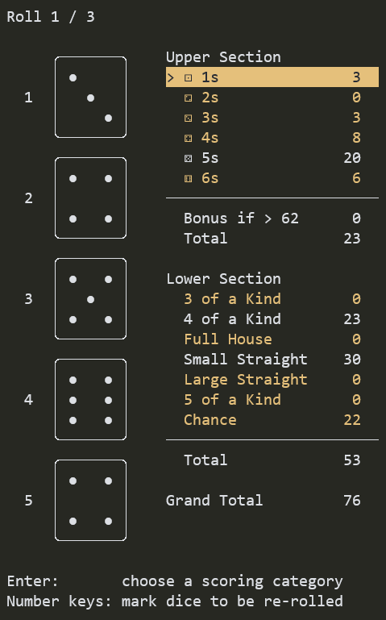

# yachtee

[](https://github.com/mosmeh/yachtee/actions)

A dice game in terminal



## Installation

Clone this repository and run:

```sh
cargo install --path .
```

## How to play

Just start the game:

```sh
yachtee
```
